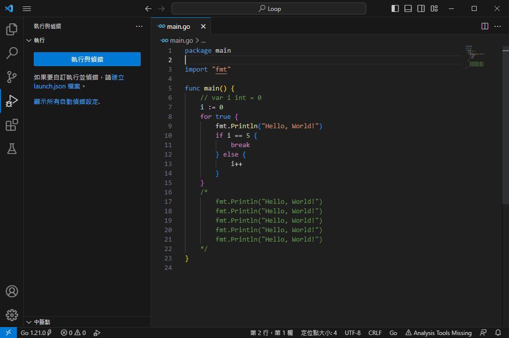

# 註解
每個程式語言的都必定會有的功能，只要在你想要下註解的地方下註解就可以，最主要的目的是，幫助接手讀者Code的其他人能夠更快的理解讀者當下的想法，或是之後需要回頭修改自己Code的時候可以更快速的掌握。大多數語言有分單行註解與多行註解，這部分主要是看各語言如何劃分，以Go語言為例
- 單行註解： **"//"**
- 多行註解： **"/\**/"**

### 顯示的範例如下，第6行是單行註解，第16與第22行為多行註解，而17~21為註解範圍內的Code

