# 基礎環境設置：編輯器

每個語言的入門都一定要先安裝編輯器，常見的編輯器有筆記本、NotePad++、VIM、Nano、VSCode等等可以進行Coding(編碼)的軟體，這邊主要使用 **"VSCode"** 做介紹

## **筆者以 **"windows"** 為例，其他讀者若是用其他系統則參考其他作者的安裝方式，這邊不做過多的贅述。**

這邊以圖片說明的方式說明如何安裝編輯器與設置語言為繁體中文，首先開啟 **"瀏覽器"** 依照個人習慣可以是Google Chrome、Microsoft Edge、Internet Explorer，這邊以 **"Microsoft Edge"** 為主，讀者可以選擇自己所喜歡或常用的瀏覽器。

### 開啟瀏覽器並且搜尋"[vscode](https://code.visualstudio.com/)"(讀者當然也可以直接點這邊的連結)
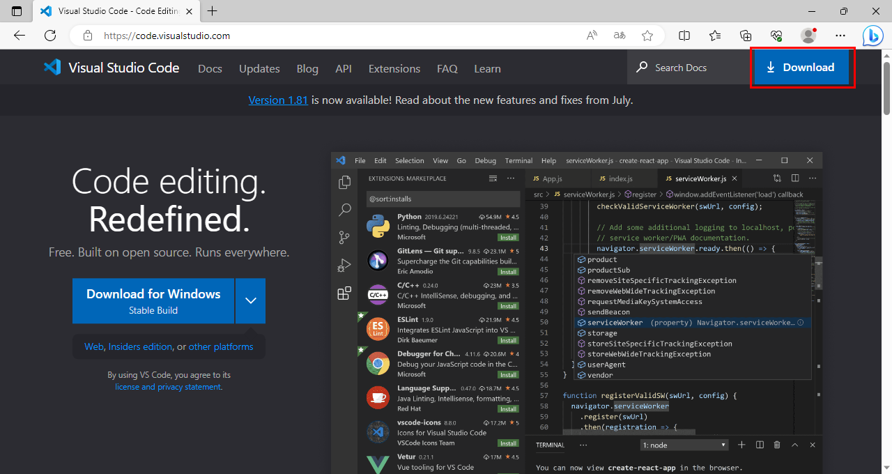
### 在連到 **"vscode"** 的官網之後點選右上角的下載後會看到下面的畫面。
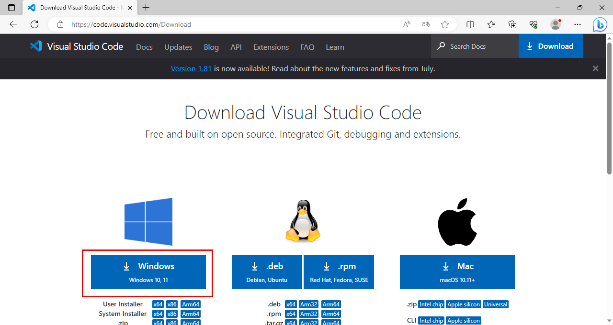
### 選擇讀者所使用的系統類型，這邊選擇windows，下載完成後會顯示當前的檔案名稱，並開啟
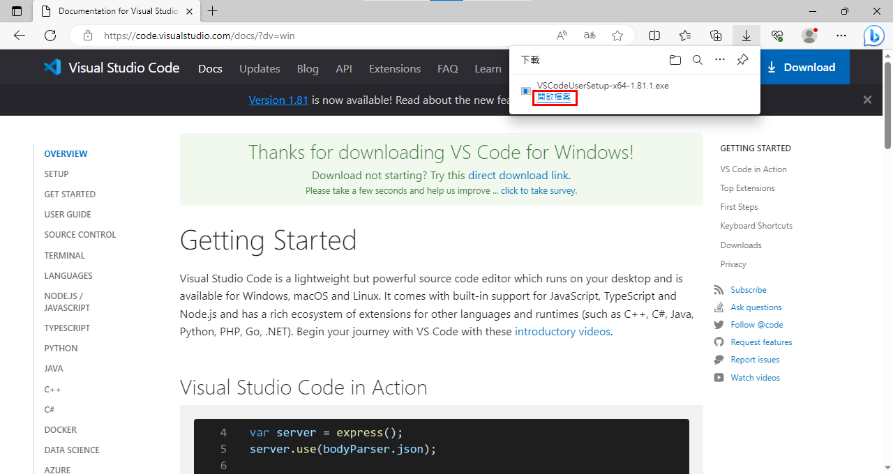
### 當開啟後第一個顯示的會是授權合約(如果有需要可以詳讀，基本上如果不是反組譯或是破解這個編輯器是沒什麼爭議的事情，他是開源且公開的程式，除非能力到很高階不然沒必要擔心這邊的問題)，基本上就是同意此授權書之後下一步就可以
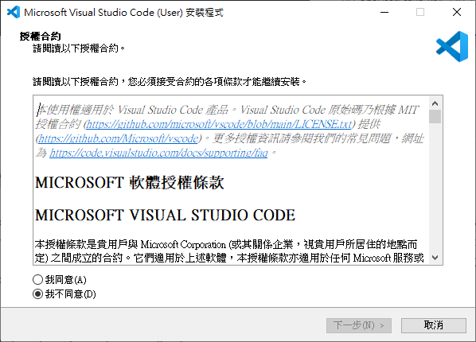
### 這邊會顯示預設安裝位置，依個人喜好選擇要放置何處，這部分後續有需要可以在詢問筆者的看法，不過先按下一步就可以
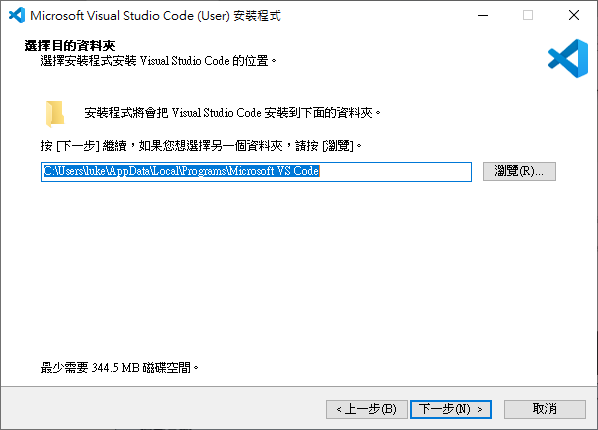
### 這邊就是說是否要在開始裡面建立資料夾，方便以後按開始就可以開啟VSCode，筆者主要是會多點方向可以開啟VSCode，因此直接下一步就好
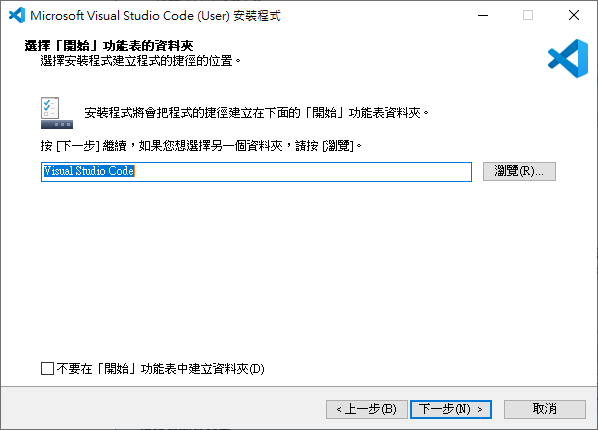
### 這邊跟上一步類似，筆者是會全部都勾選，桌面、滑鼠右鍵都可以開啟VSCode，選好之後就按下一步
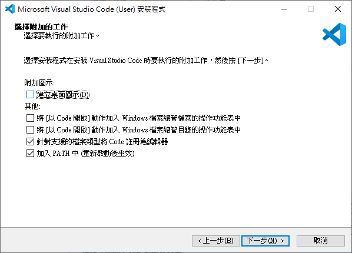
### 前面設定好之後就直接安裝就好
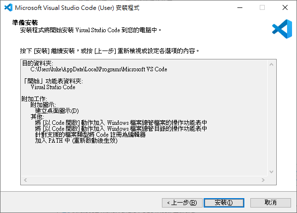
### 安裝完之後預設會是完成安裝程式後會開啟VSCode，這邊不用特別去改他就直接按完成離開安裝程式就好
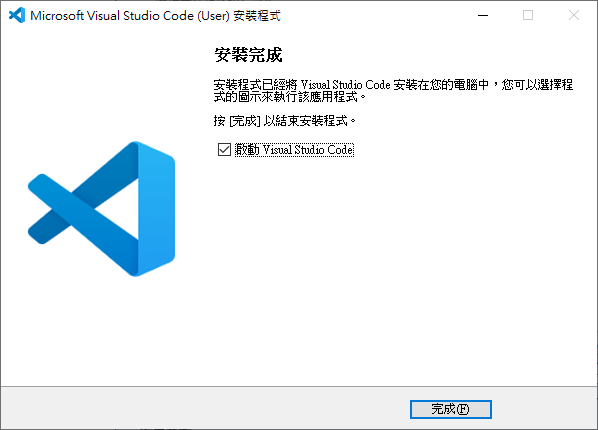
### 下面就是最譯開始在之前沒有安裝過VSCode的畫面，到這邊編輯器的安裝還沒有完成，讀者會發現似乎功能表的選擇都是英文的，接下來要安裝繁體中文語言包讓現在的介面從英文變成中文，點選左邊的**"Extension"** 選單
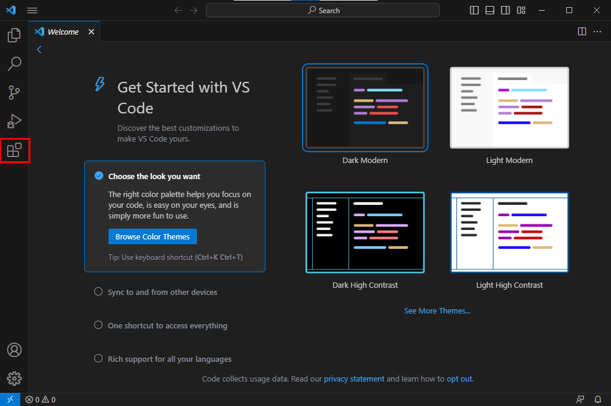
### 在上面的 **"Search Extensions in Marketplace"** 這邊點選並輸入中文
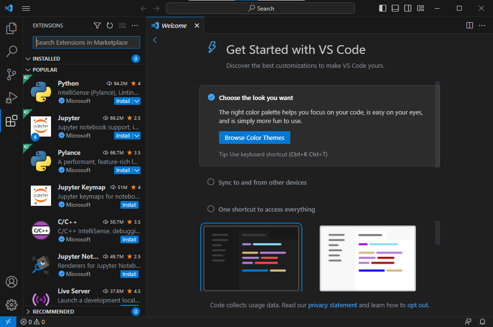
### 然後點選下面的選擇當中 **"中文(繁體)"** 旁邊的 **"install"** 按鈕
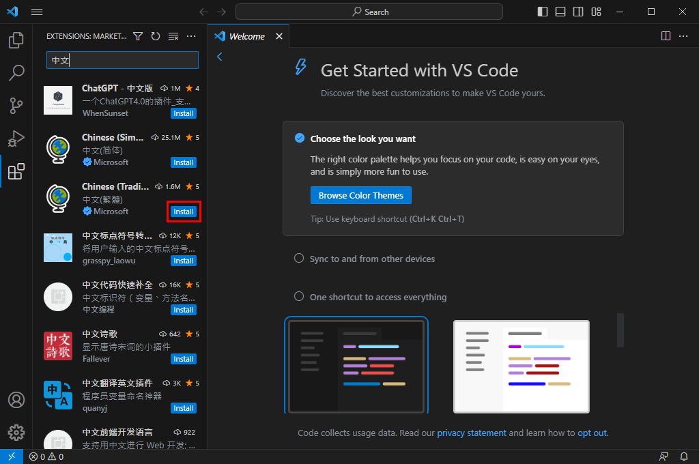
### 安裝完之後右下角會跳出提是訊息 **"是否要改變語言並重新啟動VSCode"** ，就按下 ** "Change Language and Restart"** 就可以把當前的介面語言變成中文了
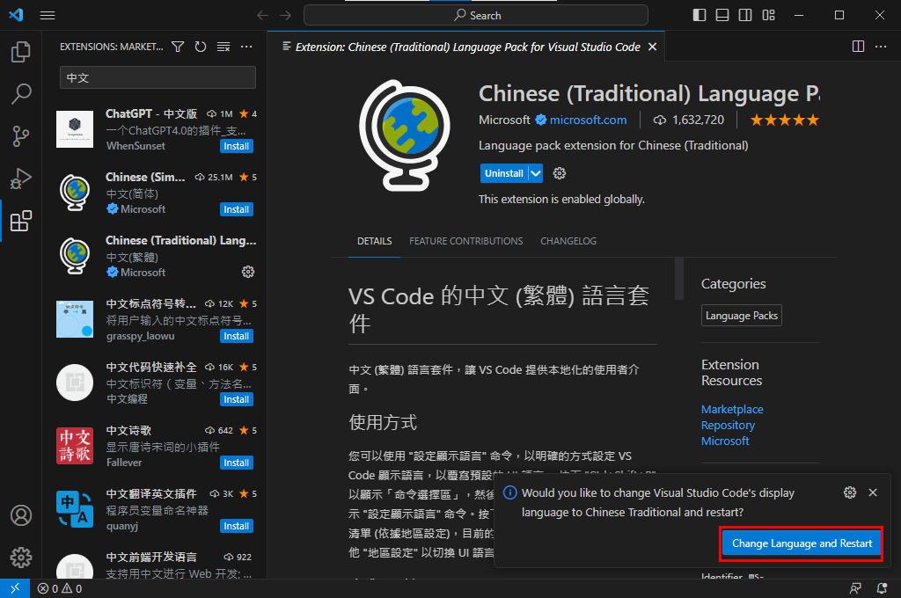
### 到這邊就是VSCode的安裝完成了，正個介面大概有90%都是中文了，若有需要可以在自行切換語言，畢竟VSCode主打的就是自由，若佈景主題不喜歡黑色也可以切換成白色或其他顏色，但比這建議維持黑色會比較好，這樣對於長時間看Code會使眼睛不易疲勞與加深近視
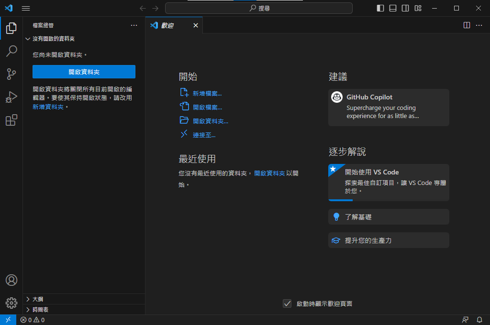