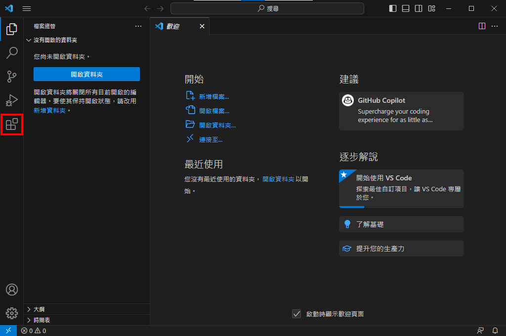

# 基礎環境設置：語言

當編輯器安裝完成之後需要在安裝每個語言相關的基礎工具才能正式運行，筆者以 **"GO"** 為主，其他語言也是類似的方式去設置基礎的部分。

## 這邊僅單純以編輯器的Coding為主，其餘的暫時先不考慮，若有需要可以在詢問筆者做較詳細的說明。
### 首先要先去GO的[官方網站](https://go.dev/)下載官方所發行 **"最新"** 的工具包(安裝包)，這邊不考慮版本的問題，是這個語言的特性用最新的工具包是最適當的，但其他語言不見得會這麼接受，需要依照各語言的需求而定，詳細的部分可以在社群上或私下與筆者討論。點選 **"Download"** 進入下載頁面。

### 由於筆者所用的系統是**windows**所以要下載 **"windows版"**

### 下載後開啟該檔案

### 開啟之後直接進入下一步

### 版權聲明的部分如果有需要可以自行翻閱

### 安裝路徑，除非有必要，不然就用原始的位置就可以了

### 接下來直接安裝就可以了

### 在安裝前有可能會有對讀者的電腦有影響有所變動影響，許多語言都有可能會碰到這種問題，安全性機制會提示用戶，這邊直接按 **"是"** 就可以了

### 到這邊就使安裝完這個語言的工具包了，接下來必須要去編輯器內安裝官方提供的VSCode套件才可以透過VSCode編寫Go語言

### 開啟原先所安裝好的VSCode，跟安裝語言包一樣到到左方的 **"延伸模組"**

### 在上面的搜尋打上 **"GO"** ，並且按下 **"安裝"** 

### 到這邊 **"GO"** 的延伸套件就完成了
