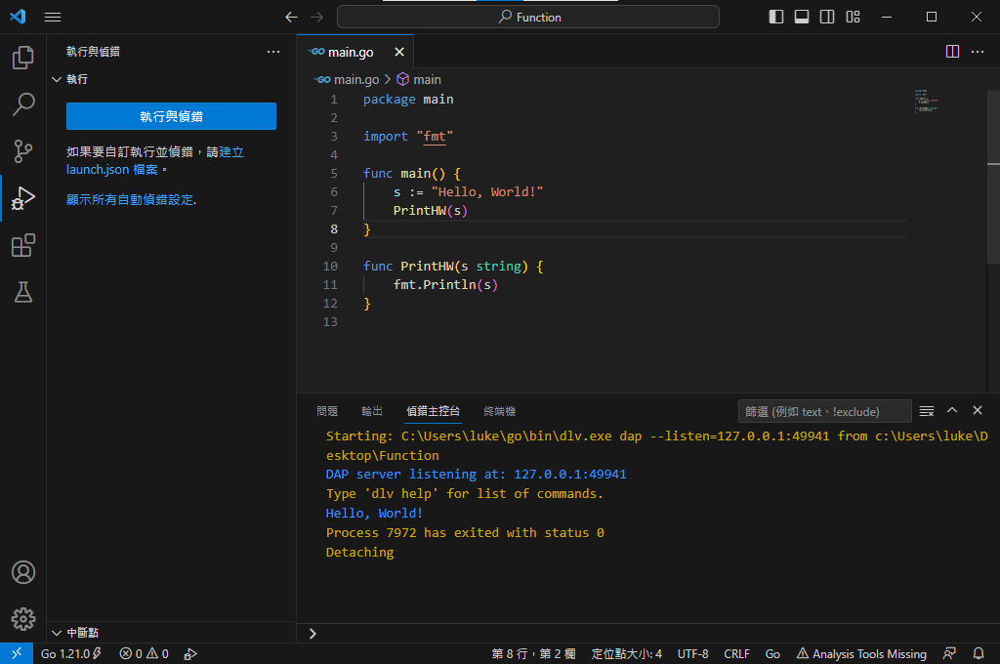

# 函式
每個程式語言基本上都會有的功能，這是模塊化的基礎，也是物件導向的基礎，這邊不會做過多的說明這些延伸的部分，主要是說明函是如何寫，以Go為例：

### 上圖的Code當中輸出字串的方式已經放到 **"PrintHW()** 內， 在第6行的 **"Hello, World!"** 作為變數傳入這個函式，並且透過這個函式輸出到畫面上，若是Code數量很龐大就必須要用函式的功能盡可能讓龐大的Code拆分成多個小函式，一方面是可以使Code的更加模組化，一方面是讓其他人接手讀者的Code時可以不必在一個大函式內做過於複雜的演算法推理。

### 到這邊基本上筆者認為的初階範圍就告一個段落，若有需要可以在社群上提問或是私下諮詢筆者關於基礎的概念。