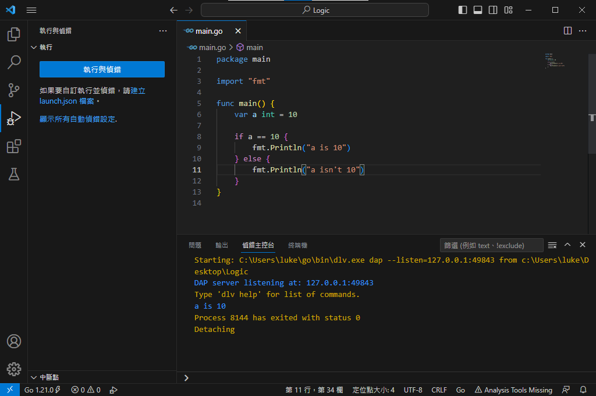
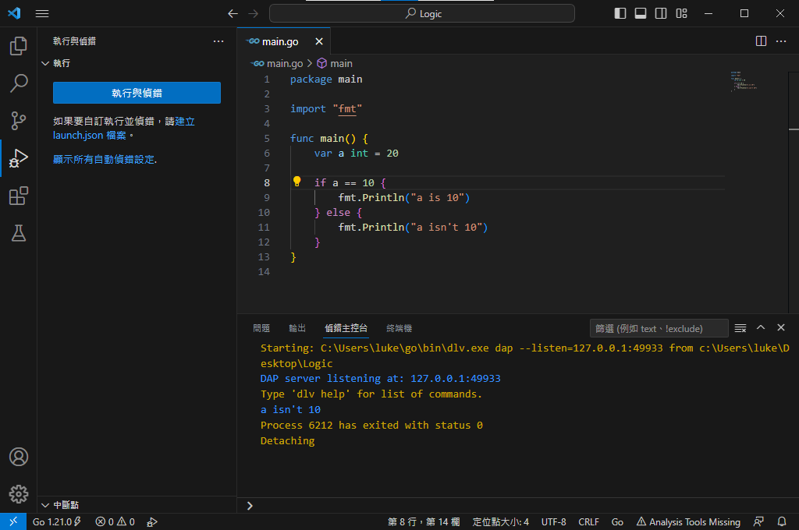
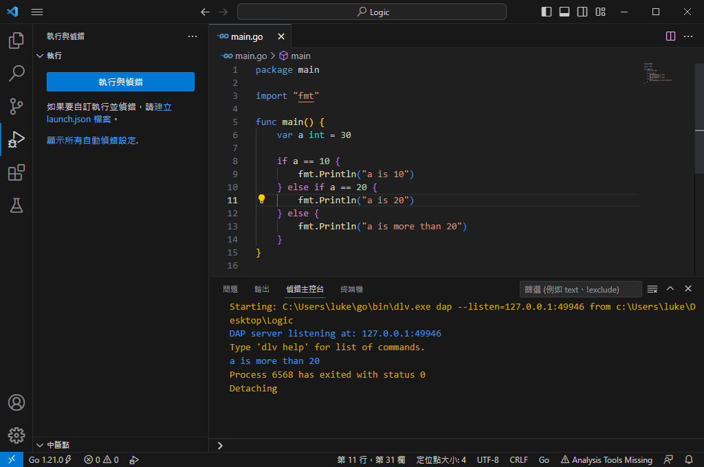

# 邏輯
在每個程式語言當中必定會出現的東西就是邏輯判斷，在Code內部數值必須要判斷該數值是否與另一個相等、不相等、大於、小於等等，這些的判斷就是邏輯。邏輯最簡單的說法就 **"非A則B"**，讀者自學或是上課會學到的 **"if...else..."** 就是Coding領域的邏輯基礎，有些讀者可能有聽過或讀到過switch，它也是邏輯判斷的一環；下面會演示兩段邏輯的演算法：
  

上述代碼整個流程如下：
1. 第6行宣告一個變數a數據類型是int，並裝有10這個數值
2. 第8行的時候進行邏輯判斷a所裝有的數值是否 **"等於"** 10 
3. 因為第8行的判斷是成立的所以會得到結果true，從而進入第9行，輸出 **"a is 10"** 到輸出視窗

### 以上的程式碼就是基本的邏輯判斷，接下來看看如果判斷為不成立時的程式碼

上述代碼整個流程與前一個沒有太大的差別唯一差別的地方就是在第8行的時候判斷：
1. 第6行宣告一個變數a數據類型是int，並裝有20這個數值
2. 第8行的時候進行邏輯判斷a所裝有的數值是否 **"等於"** 10 
3. 因為第8行的判斷是不成立的所以會得到結果false，從而進入第11行，輸出 **"a isn't 10"** 到輸出視窗

### 以上兩個就是單純的邏輯判斷，當然讀者也有可能已經讀到連續的邏輯判斷，比如以下的程式碼：

上述代碼整個流程如下：
1. 第6行宣告一個變數a數據類型是int，並裝有30這個數值
2. 第8行的時候進行邏輯判斷a所裝有的數值是否 **"等於"** 10 
3. 因為第8行的判斷是不成立的所以會得到結果false，因此會來到第10行判斷a的數值是否 **"等於"** 20
4. 因為第10行的判斷是不成立的所以會得到結過false，因此從而進入第13行，輸出 **"a is more than 20"** 到輸出視窗

### 以上就是邏輯判斷的基礎部分，有些語言可能沒有switch，這邊就不特別說明switch是如何運作的，若讀者有需要可以在之後與筆者做討論或是在社群上面發問。