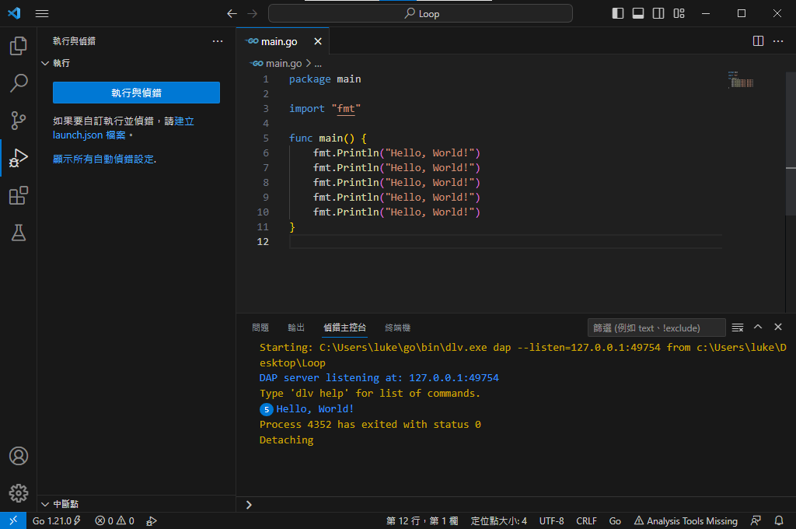
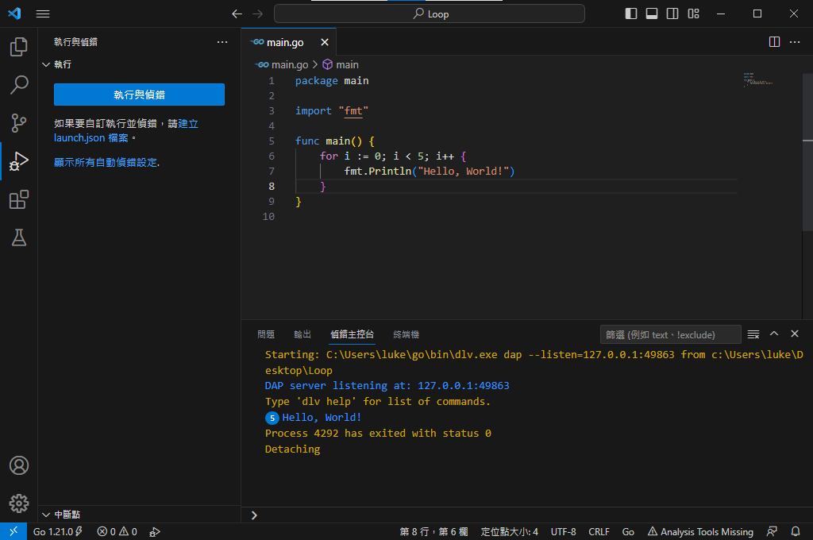
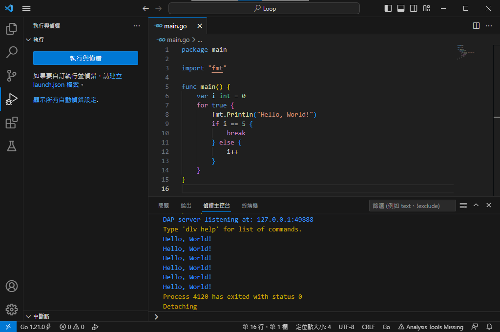

# 迴圈
迴圈從字面上的意思讀起來就是重複做同一件事的概念，讀者可能會有點模糊的感覺，這邊舉例一個最簡單的例子，假設要連續輸出　**"Hello World!"** 五次呢?
### 一般人的想法就是寫5次就好，程式碼如下：

### 假如現在要寫20次、30次甚至是100次呢？這樣子是不是很重複，而且必須要滾輪一直滾到最後面才能看到後面的Code?如果是逐字敲的人是否會很崩潰？迴圈就是在簡化這種重複性到的動作，讓Code的可讀性上升，上面的Code用迴圈的寫法如下：

### 結果是相同的但是Code很大的不同，這就是迴圈的影響，現在如果改成要20、30甚至是100都沒有太大的難度只要修改終點值就可以。
#### 讀者在這部分可能會不了解為什麼這邊要這樣寫，接下來跟讀者說明：
```Go
for i:=0; i < 5; i++
```
上面的條件就是基本的有次數的迴圈基本結構：
- i := 0：這是Go的特殊寫法，類似前面的變數宣告方式 **"var i int = 0"** ，意思是說這個迴圈 **"當前的值"** 從 **"0"** 開始的意思
- i < 5： **"當前的值"** 是否有小於5，如果有成立才會執行目前的大括號內的內容
- i++：當大括號裡的內容執行完畢之後 **"當前的值"** 加1
  
### 這邊的結構就是標準的逐項[迭代](https://zh.wikipedia.org/zh-tw/%E8%BF%AD%E4%BB%A3)(Iterator)的寫法，每個語言都會有每個語言的特殊寫法，但這種寫法基本上是大多數語言通用的方式，如果讀者想了解可以在社群或是與筆者聯繫

### 有次數限制的迴圈當然也有沒有次數限制的迴圈，Go語言的迴圈都是用 **"for"** 只在於後面所帶的條件不同罷了，下面是連續執行5次後跳出這個無窮迴圈的Code


### 筆者在這個迴圈裡面寫下邏輯判斷主要是讓這個迴圈不會變成無窮迴圈，讀者若是不注意迴圈的終點，就很有可能會變成無窮迴圈，因此在使用這種的迴圈要注意終點在哪，若對於這個迴圈當中的邏輯判斷有想了解的可以在社群上面詢問或是與筆者聯繫。