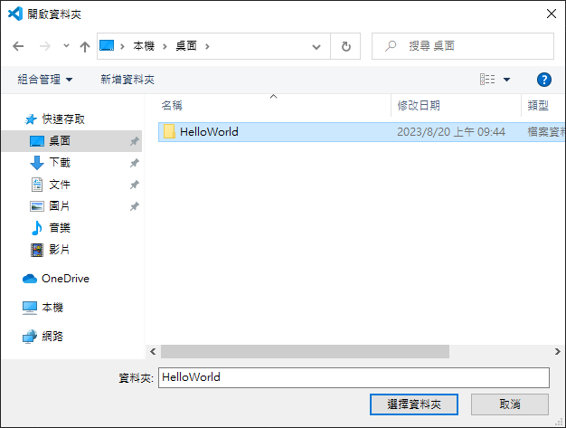

# 程式起點：Hello World

每個程式語言在入門的時候都會要求寫出最初的第一個程式[Hello World](https://zh.wikipedia.org/zh-tw/Hello_World)，它僅僅有一小段Code，就可以用來確認Coding環境、程式開發或執行環境是否已經安裝妥當的常見手段。所有的語言只要能正確顯示出 **"Hello World!"** 就表示這個語言的最初安裝與設定是正確的。
### 在開始Coding之前必須要先開啟專案的資料夾，所有程式語言的架構都是建立在 **"專案"** 的方式做設計，因此要先設定目標專案名稱才能開始Coding，先開啟 **"檔案總管"** (開啟方式沒有限制，筆者的電腦有調整過，因次會顯得較為簡單)

### 假設要存放專案的位置是在桌面上，就前往 **"桌面"** 

### 在現在的 **"位置"** 新增資料夾並設定它的名稱為你想要的名稱(比如現在要做的 **"HelloWorld"** ) 
#### *這邊要有個觀念是名稱最好是用英文與數字，這部分會是與編碼格式有關，詳細的部分可以在社群或是私下詢問筆者*

### 在新增好並設定好名稱後就是完成專案的基底，現在就是要用VSCode做開啟，開啟的方式有三種：
1. 開啟VSCode後再開啟資料夾
2. 直接在目標資料夾內選擇用VSCode開啟
3. 用終端機(命令及提示字元)開啟
#### 第三個方式筆者不在這邊做說明因此，僅說明前兩個方式
#### 1. **開啟VSCode後再開啟資料夾**

#### 用這種方式開啟有可能下次不會是這個畫面，因此可以按左上角的選單 $\Rightarrow$ 檔案 $\Rightarrow$ 開啟資料夾

#### 之後會跳出下面的畫面後找到讀者剛剛所新增的 **"專案資料夾"**選取它並按右下角的 **"選擇資料夾"**

#### 2. **直接在目標資料夾內選擇用VSCode開啟**，直接在所設定的 **"專案資料夾"** 內按右鍵，點選 **"以Code開啟"**

#### 上述兩種方式都可以開啟，但筆者比較偏向後者，會比較直覺。在開啟資料夾後有可能會碰到安全性問題，這是因為系統預設的安全性機制，所以會導致這個提示的出現，基本上讀者的電腦若是自己使用的話，就不用太過於擔心這個問題，直接按 **"是，我信任作者"** 就可以了。

### 到這邊就是專案開啟的完成，接下來要進行的是創建第一份程式碼，若是將鼠標移動到組邊的檔案總管時會發現突然出現有四個選項可以選擇從左到右分別是：
- 新增檔案
- 新增資料夾
- 重新整理
- 摺疊當前選擇的資料夾
### 選擇 **"新增檔案"**

### 選擇後下面會出現要輸入的檔案名稱與類型，這是每個Coder都要知道的部分，因為每個語言所使用的類型不同所以會有很大的差異

### 這邊以 **"HelloWorld.go"** 為例子，在新增完檔案之後VSCode會順便檢查還有哪些東西未安裝的，直接按 **"Install"** 就可以讓VSCode自動幫你安裝尚未安裝的部分。

### 讀者可能會覺得按下去之後沒什麼變化，但其實是有的，只不過對於讀者不用去擔心這種問題直接點選上方 **"分頁"** 旁邊的 **"關閉"** 就好(筆者比較傾向畫面不要有太多分頁，因此當前用不到的分頁都會關閉，之後有需要會在開啟)

### 當回到剛剛新增的檔案畫面時也有可能會再次跳出未安裝的部分，同樣的就給它安裝吧，最後完成之後會出現如下的畫面，這時候可以關閉下方的輸出畫面，開始進入本節的主題了。


接下來要在內容寫上以下的Code
```Go
package main

import "fmt"

func main(){
    fmt.Println("Hello, World!")
}
```
### 寫出來的結果畫面如下

### 這時候要保存才可已算是編寫完成當前的進度

### 儲存完之後眼尖的會發現原本關閉的按鈕從 **"$\cdot$"** 變成 **"x"**，接下來要測試這個剛剛所編寫的代碼結果是否如預期的方式，點選左邊的 **"執行與偵錯"**

### 在這邊按下 **"執行與偵錯"** 就可以開始偵錯了

### 會跳出缺少延伸模組的問題，同樣的給它安裝就好

### 安裝完成之後會跳出安裝完成的訊息，由於之前沒有安裝偵錯的模組因此並未執行偵錯，要在按一次執行偵錯才行

### 再次執行可能會碰到防火牆的問題，這是基於安全性的機制所以會一直跳出類似的畫面，按下 **"允許存取"** 就可以了

### 到這邊出現的錯誤輸出 **"Hello World"** 已經很接近了，接下來只要處理好這個問題就可以正確的執行輸出 **"Hello World"**， 點選上面的標題搜尋 **"Hello World"** 
#### 這是VSCode的一大特色，所有功能都可以透過這邊的方式尋找，但這邊先不做過多的贅述，讀者有需要往後可以慢慢研究。

### 接著輸入 **">go mod"**，VSCode會自動幫讀者篩選讀者所需要的功能。畫面上框選的這個就是我們所需要的

### 選擇之後會跳出另一個對話框，這邊就是要我們寫上這個專案的名稱，由於僅做 **"Hello World"**，因此不用在乎它需要什麼格式或是名稱，填上這個專案的名稱就好，例如：**HelloWorld**，填完之後按下Enter就會自動幫讀者建立所缺少的 **"go.mod"** 檔案

### 建立完後可以在檔案總管確認是否有新增這個檔案

### 確認完檔案之後記得要讓右邊的畫面保持在當前的go程式碼，否則無法出現輸出的結果，當確認在這個畫面之後同樣的按下 **"執行與偵錯"**

### 到這邊會看到 **"Hello, World!"** 的出現，就表示讀者的第一個程式 **"Hello, World!"** 已經完成了
